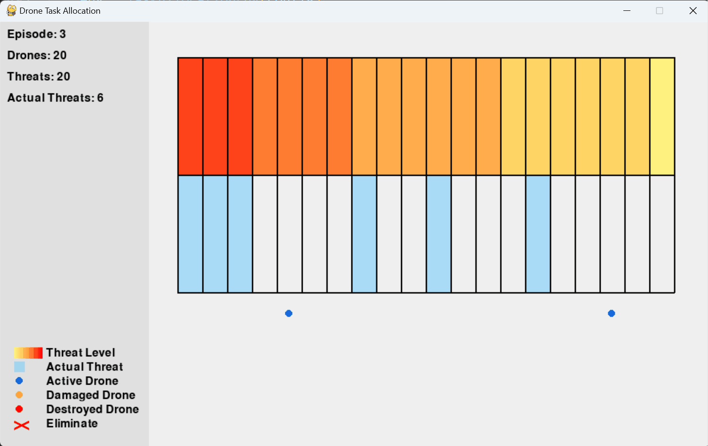

# AEC Reinforcement Learning Environment for Drone Task Allocation



## Overview

This repository provided an UAV target assignment RL environment modelled in Agent-Environment-Cycle (AEC). The environment simulates a scenario where multiple drones can be assigned to various threats, each with different threat levels.

## Problem Description

In this task allocation problem:

- There may have a variable number of drones (agents) and threats.
- Each threat has a certain threat level, represented by a probability.
- Drones should be allocated to threats to neutralize them.
- The goal is to optimize the allocation of drones to threats to maximize overall performance.

## Environment Design

The environment is designed using the PettingZoo library's AEC paradigm. Key features include:

1. **Variable number of agents**: The number of drones can vary between episodes.
2. **Threat representation**: Threats are represented by their threat levels (probabilities).
3. **Action space**: Each drone can choose which threat to engage.
4. **Observation space**: Agents observe the threat levels, pre-calculated allocations, and current allocations.
5. **Reward structure**: Rewards are based on threat coverage, success rate, and other factors.

## Key Components

- `TaskAllocationEnv`: The main environment class.
- `reset()`: Initializes the environment for a new episode.
- `step()`: Processes agent actions and updates the environment state.
- `observe()`: Returns the current observation for an agent.
- `render()`: Visualizes the current state of the environment.

## Visualization

The environment includes a detailed visualization system using Pygame. It displays:

- Threat levels (color-coded)
- Actual threats
- Drone allocations
- Eliminated threats
- Various statistics and information

## Usage

To use this environment:

1. `pip install -r requirements.txt`
2. Import the environment:

```python
from task_allocation_env import raw_env

env = raw_env()